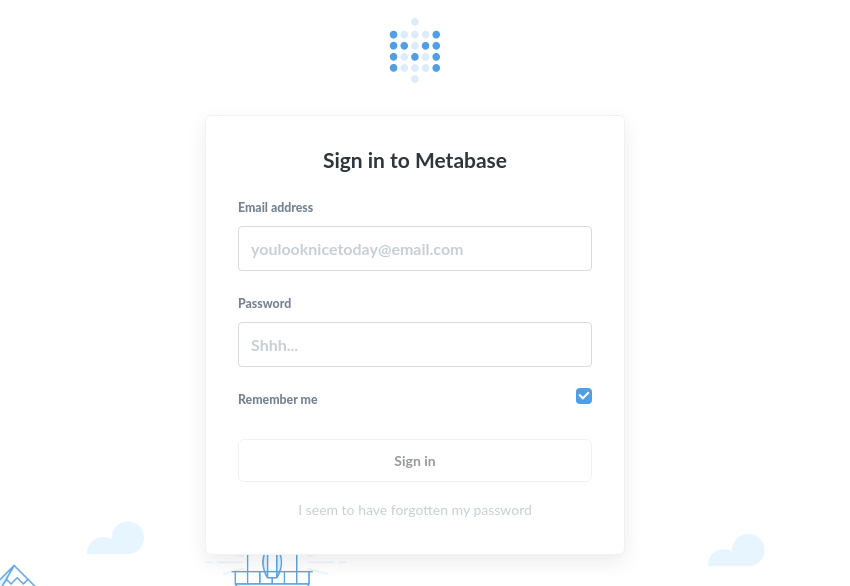
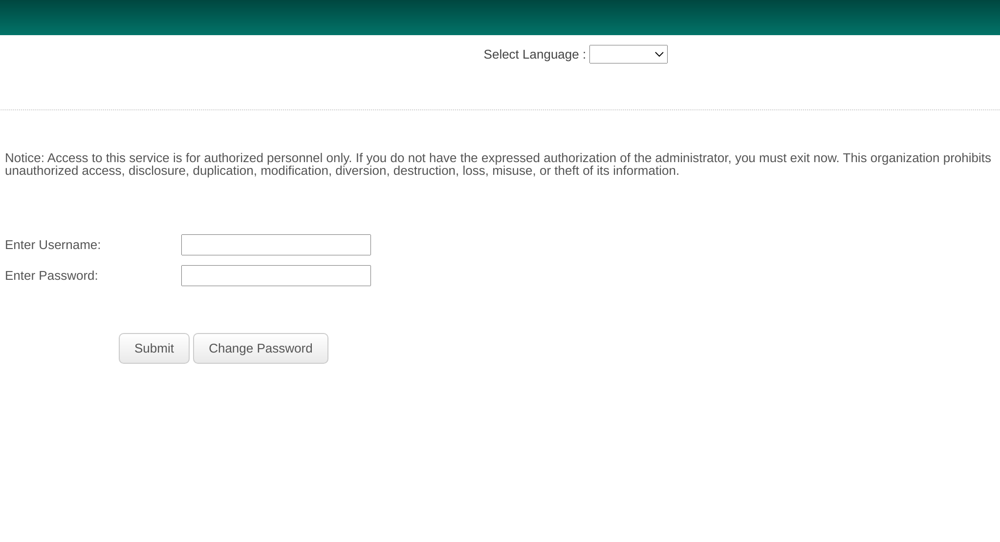

# Bahmni Docker

Docker Compose project to start a Bahmni server locally.

<p align="left">
  
  
  
  </p>

## Quick Start

### Clone the project:
```
git clone https://github.com/mekomsolutions/bahmni-docker
cd bahmni-docker
```

### Retrieve the Bahmni distribution of your choice:

The Docker images do not provide a default Bahmni distribution so you need to first fetch one.
You have multiple options available:
- Clone and build one of the Bahmni Distros ([Haiti](https://github.com/mekomsolutions/bahmni-distro-haiti), [C2C](https://github.com/mekomsolutions/bahmni-distro-c2c) , [HSC](https://github.com/CRUDEM/bahmni-distro-hsc), [Cambodia](https://github.com/mekomsolutions/openmrs-distro-cambodia)...)

- or manually download the Zip distro from Nexus:
https://nexus.mekomsolutions.net/#browse/search=name.raw%3Dbahmni-distro-*


Once you have the Zip file (built or downloaded) unzip it in `/tmp/` for instance:

Export you distro name as env var:
For example:
```
export DISTRO_GROUP="haiti"
```

```
unzip path/to/the/zip/file -d /tmp/bahmni-distro-$DISTRO_GROUP/
```

### Export the variables:

The Bahmni Docker project relies on environment variable to document where the Distro sources are to be found.
As an example, you can export the following variables:
```
export DISTRO_PATH=/tmp/bahmni-distro-$DISTRO_GROUP;  \
export OPENMRS_CONFIG_PATH=$DISTRO_PATH/openmrs_config;  \
export BAHMNI_CONFIG_PATH=$DISTRO_PATH/bahmni_config;  \
export OPENMRS_MODULES_PATH=$DISTRO_PATH/openmrs_modules;  \
export BAHMNI_APPS_PATH=$DISTRO_PATH/bahmni_emr/bahmniapps
```

### Start Bahmni:

```
docker-compose -p $DISTRO_GROUP up
```
<p align="center">

</p>

**Important:** This assumes that you run the `docker` command as the same user and in the same window in which you exported your variables.
If Docker is run as `sudo`, the variables won't have an effect. Make sure to either export them as root, or run `docker` with `sudo -E` option to preserve the user environment. See [Docker on Linux Post-install steps](https://docs.docker.com/engine/install/linux-postinstall/)

### Access the servers:

- Bahmni: http://localhost/

<p align="left">

</p>


- OpenMRS: http://localhost/openmrs

<ins>Default credentials</ins>:
  - username: superman
  - password: Admin123

<p align="left">

</p>

- Odoo: http://localhost:8069/

<ins>Default credentials</ins>:
  - username: admin
  - password: admin

<p align="left">

</p>

- Metabase: http://localhost:9003/

<ins>Default credentials</ins>:
  - username: admin@metabase.local
  - password: Metapass123

<p align="left">

</p>

- OpenELIS: http://localhost/openelis

<ins>Default credentials</ins>:
  - username: admin
  - password: adminADMIN!

<p align="left">

</p>

## Advanced

### TLS support

To enable TLS support, just add the line:

```
  command: "httpd-foreground -DenableTLS"
```
to the `proxy` service in the [docker-compose.yml](./docker-compose.yml) file.

Default certificates are self-signed and therefore unsecured.

Provide your own valid certificates as a bound volume mounted at `/etc/tls/`.

The `proxy` service would look like:
```
services:
  proxy:
    command: "httpd-foreground -DenableTLS"
    build:
      ...
    volumes:
    - "/etc/letsencrypt/live/domain.com/:/etc/tls/"
    - ...

```
### Start with a custom MySQL dump

To start OpenMRS with your own database, just drop your data file (`.sql` or `.sql.gz`) in the [./sqls/mysql/](./sqls/mysql/) folder and recreate your volumes (`docker-compose -v down`).


### Disable individual services
If you are developing, you may not want to run the complete Bahmni suite.
You can disable services by adding **docker-compose.override.yml** file at the project root with the following contents:

**./docker-compose.override.yml**
```
#
# Example file to disable docker-compose.yml services.
#
version: "3.7"

services:
  metabase:
    entrypoint: ["echo", "[ERROR] Service is disabled in docker-compose.override.yml file"]
  bahmni-mart:
    entrypoint: ["echo", "[ERROR] Service is disabled in docker-compose.override.yml file"]
  odoo:
    entrypoint: ["echo", "[ERROR] Service is disabled in docker-compose.override.yml file"]
  odoo-connect:
    entrypoint: ["echo", "[ERROR] Service is disabled in docker-compose.override.yml file"]
  postgresql:
    entrypoint: ["echo", "[ERROR] Service is disabled in docker-compose.override.yml file"]
```

You can also of course comment the services directly in the [docker-compose.yml](./docker-compose.yml) file.

### Develop in Bahmn Apps

Bahmni Docker project can be used to setup a dev environment for Bahmni. This is especially easy when working on Bahmni Apps.


This can be done by using `watch rsync ...` command to see your changes on the running server.
1. Clone and build Bahmni Apps locally:
```
cd ~/repos
git clone https://github.com/Bahmni/openmrs-module-bahmniapps.git
cd openmrs-module-bahmniapps/ui
```
Change JS and HTML files as you like.

2. Run the `watch rsync` command to override the server files: (using `watch` makes it run every 2 seconds)
```
watch rsync -av ~/repos/openmrs-module-bahmniapps/ui/ /tmp/bahmni-distro-haiti/bahmni_emr/bahmniapps/
```

### Debug the Java apps

The Java apps (OpenMRS, Bahmni Reports, Odoo Connect...) can be remote debugged very simply by setting a the `DEBUG: "true"` environment variable to the service.

Don't forget to open the port `8000` on the service as well:
Eg:
```
...
environment:
  DEBUG: "true"
...

ports:
  - 8000:8000
...
```

### All environment variables


`OPENMRS_CONFIG_PATH`: Path to a custom OpenMRS Configuration. See [OpenMRS Initializer](https://github.com/mekomsolutions/openmrs-module-initializer/) for more information.

`BAHMNI_CONFIG_PATH`: Path to a custom Bahmni Config folder.

`OPENMRS_MODULES_PATH`: Path to custom set of OpenMRS modules.

`BAHMNI_APPS_PATH`: Path to Bahmni Apps sources.

`BAHMNI_HOME_PATH`: Path to Bahmni Home. Bahmni Home is mostly used to

`TIMEZONE`**\***: Server timezone. See https://en.wikipedia.org/wiki/List_of_tz_database_time_zones for a complete list of possible Timezones.

`BAHMNI_MART_CRON_TIME`**\***: Provide a custom cron time (in Crontab format) for the Bahmni Mart flattening. Default is `30 21 * * *` - i.e. 10:30 PM every day.

`ODOO_EXTRA_ADDONS`: Path to Odoo additional addons.

`ODOO_CONFIG_PATH`: Path to a custom Odoo Configuration. See [Odoo Initializer](https://github.com/mekomsolutions/
odoo-initializer/) for more informations.

**\*** Note: Variables with a **\*** require the containers to be rebuilt. Use `docker-compose build`


## Known limitations

- Supported components:
  - OpenMRS
  - Bahmni Apps
  - Bahmni Config
  - Bahmni Mart
  - Metabase
  - Odoo
  - Odoo Connect
  - OpenELIS
